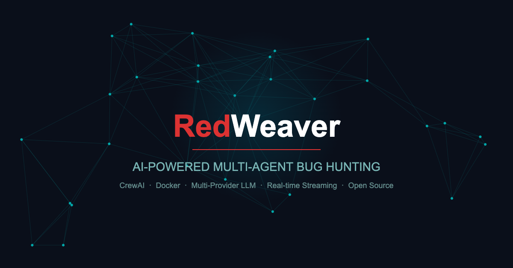
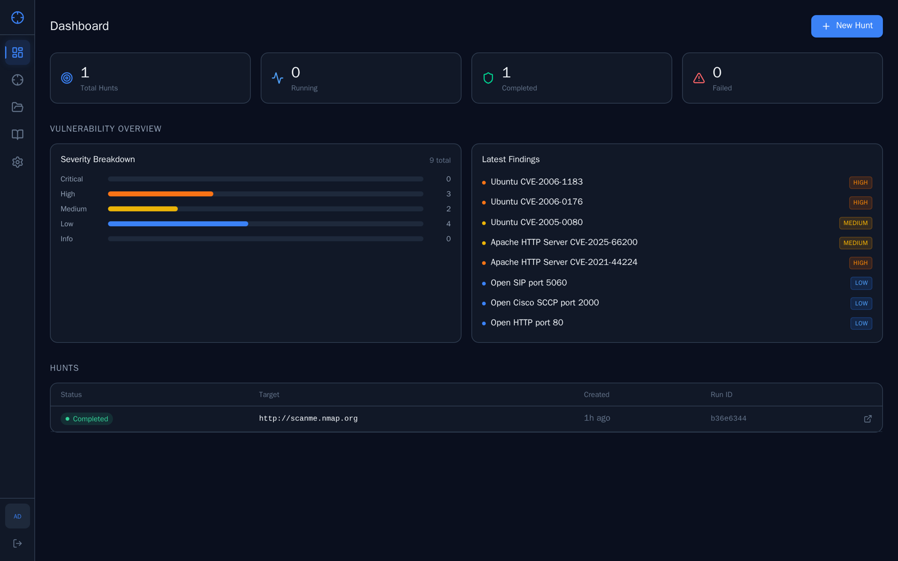
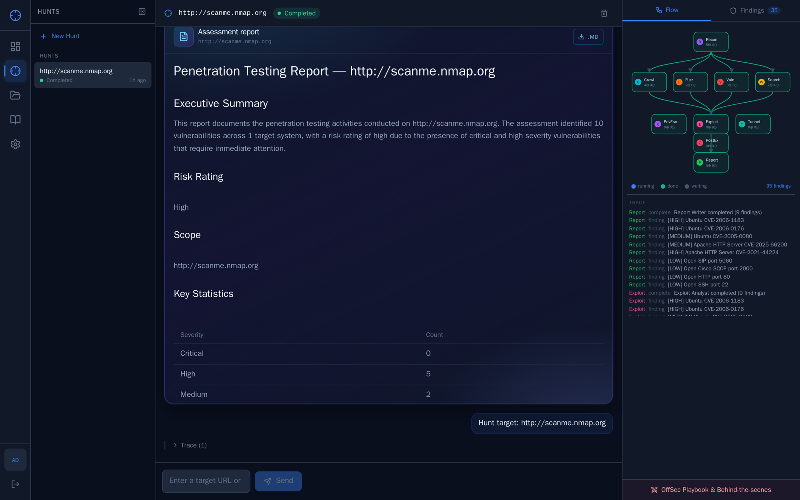
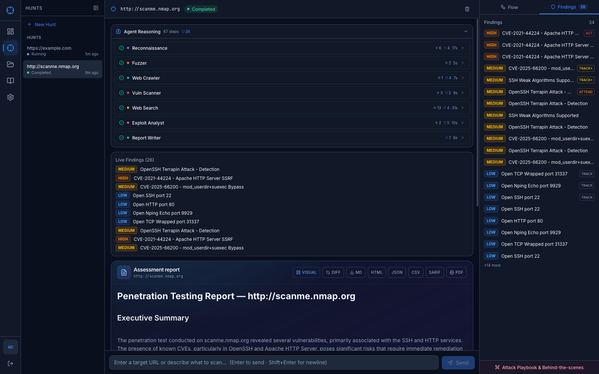
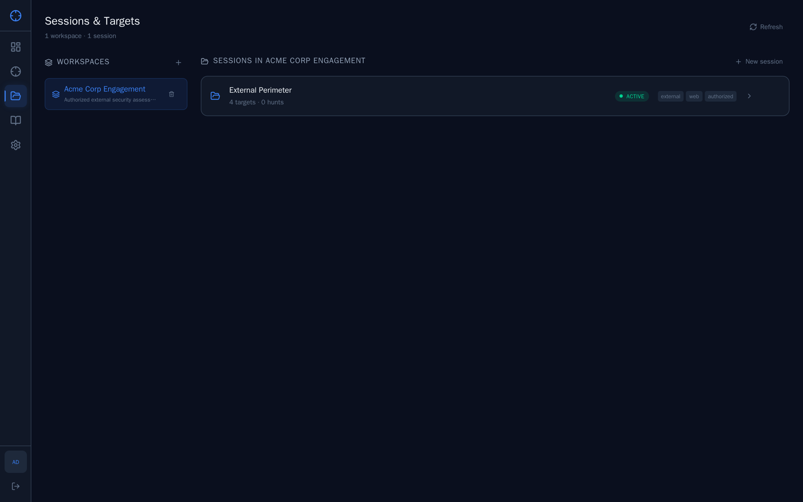
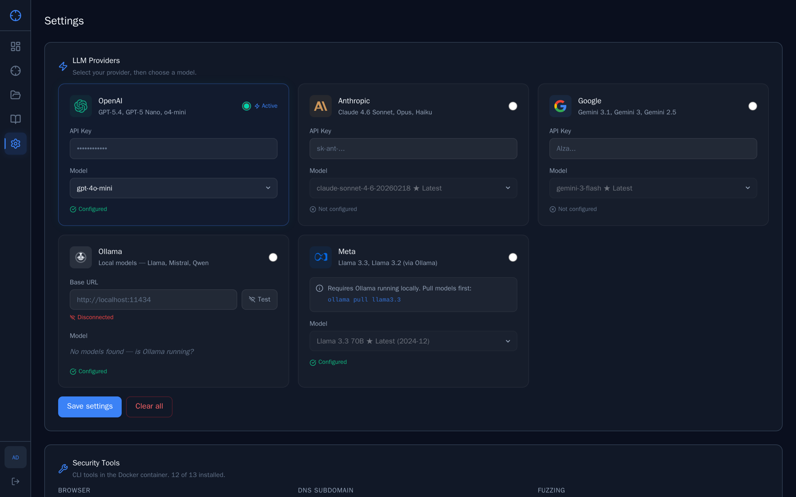
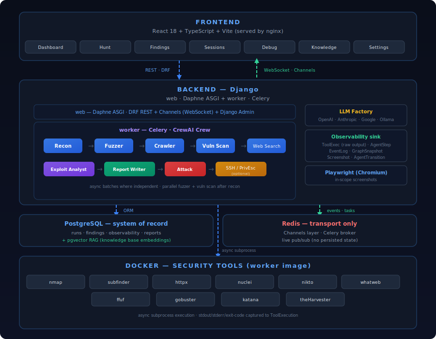

<p align="center">
  
</p>

<p align="center">
  <a href="#quick-start">Quick Start</a> &bull;
  <a href="#ui-overview">UI overview</a> &bull;
  <a href="#architecture">Architecture</a> &bull;
  <a href="#agent-pipeline">Agents</a> &bull;
  <a href="#tools">Tools</a> &bull;
  <a href="#llm-providers">LLM Providers</a> &bull;
  <a href="#contributing">Contributing</a> &bull;
  <a href="#license">License</a>
</p>

<p align="center">
  
  
  
  
  
  
</p>

---

## What is RedWeaver?

RedWeaver is an autonomous vulnerability assessment platform that combines LLM reasoning with real security tools. You describe a target, and a team of AI agents collaboratively performs reconnaissance, crawling, fuzzing, vulnerability scanning, exploit analysis, and report generation — all streamed to your browser in real time.

**Zero tool installation.** Everything runs inside Docker. You only need an LLM API key.

---

## UI overview

The web UI is a React app (Vite) served behind nginx in Docker. After login you get:

| Area | What you use it for |
|------|---------------------|
| **Dashboard** | Hunt stats, severity breakdown, latest findings at a glance |
| **Hunt** | Chat-driven hunts with live agent stream (SSE), in-thread pentest report, and agent flow panel |
| **Findings** | Sortable vulnerability list with severity badges, CVE references, and evidence |
| **Sessions & Targets** | Workspace-scoped projects, session management, and target tracking |
| **Knowledge Base** | Searchable methodology library — techniques, commands, and patterns |
| **Settings** | Multi-provider LLM configuration (OpenAI, Anthropic, Google, Ollama, Meta) |

### Screenshots

PNG captures live under `docs/screenshots/`. When updating them, use masked or empty API-key fields and non-sensitive targets only — never commit real keys or private hostnames in images.

<p align="center">
  <br/>
  <sub>Dashboard — hunt stats, severity breakdown, and latest findings</sub>
</p>
<p align="center">
  <br/>
  <sub>Hunt — pentest report, agent flow panel, and chat interface</sub>
</p>
<p align="center">
  <br/>
  <sub>Findings — vulnerability list sorted by severity with CVE details</sub>
</p>
<p align="center">
  <br/>
  <sub>Sessions & Targets — workspaces and project management</sub>
</p>
<p align="center">
  <br/>
  <sub>Settings — multi-provider LLM configuration</sub>
</p>

---

## Quick Start

```bash
# 1. Clone the repo
git clone https://github.com/<your-org>/RedWeaver.git
cd RedWeaver

# 2. Configure API keys
cp .env.example .env
# Edit .env — add at least one LLM key (OpenAI, Anthropic, or Google)

# 3. Build and run
docker compose up --build

# 4. Open the UI
open http://localhost:5173
```

The API is exposed at **http://localhost:8001** (host port mapped to the backend container). The UI talks to it through the frontend nginx proxy (`/api`). Type a target URL in the Hunt chat and the agents will start hunting.

### Demo login (first boot)

On a **fresh** Redis volume, the backend seeds a demo admin so you can sign in immediately:

| Field | Value |
|-------|--------|
| Email | `admin@redweaver.io` |
| Password | `redweaver` |

**Change this password** (or register a new user and delete the demo account) before exposing the app beyond your machine. See [SECURITY.md](SECURITY.md).

> **Tip:** API keys can also be configured in the **Settings** page after launch — no `.env` edits required.

---

## Architecture

<p align="center">
  
</p>

### How It Works

1. **You describe a target** — "Scan example.com for vulnerabilities"
2. **CrewAI builds a crew** — target type (web vs host) and options pick which agents run; tasks chain with shared context
3. **Tasks run in order, with parallel batches where safe** — after **Recon** completes, **Fuzzer** and **Vuln Scanner** are scheduled as **asynchronous tasks** so CrewAI can run them **in parallel**, then **Crawler** and later steps run when their inputs are ready. Steps that need prior outputs (e.g. exploit analysis after all scans) still wait — correctness comes before wall-clock speed.
4. **Findings stream in real-time** — SSE pushes every tool call, thought, and finding to the UI
5. **Report is generated** — the Report Writer produces a **structured Markdown** pentest report (headings, tables, lists, code blocks, callouts), grounded in hunt context and knowledge-base search where configured; the UI can render it in Standard or Enhanced styling

### Why the graph looks “parallel”

The **workflow graph** is a **dependency diagram**: arrows show which agents consume outputs from others (e.g. many edges from Recon). It is **not** a Gantt chart. Branches do not mean “everything runs at the same time” — they mean “these steps all use data from Recon.” Actual execution follows the crew’s task list, with **parallelism only where tools are independent** and CrewAI’s async batching allows it.

---

## Agent Pipeline

The **workflow graph** may show an **Orchestrator** node for visualization only. Which agents run depends on target type (web vs host/network) and options (e.g. SSH post-exploit).

| Phase | Agent | What It Does |
|:-----:|-------|-------------|
| 1 | **Recon** | Subdomain enumeration, port scanning, tech fingerprinting |
| 2a / 2b | **Fuzzer** · **Vuln Scanner** | Run **in parallel** after recon (async batch): fuzzing + nuclei/nikto |
| 3 | **Crawler** | Endpoint discovery, JS analysis, form extraction (web targets; waits for fuzzer when present) |
| 4 | **Web Search** | OSINT — CVE lookup, exploit databases, public disclosures |
| 5 | **Exploit Analyst** | Attack chain correlation, risk assessment |
| 6 | **Report Writer** | Structured **Markdown** report (methodology, findings, remediation) |
| 7 | **Privesc / Tunnel / Post-exploit** | Optional when SSH targets are configured |

Phases are **logical**; the exact task order is defined in code (`CrewFactory`) and may differ slightly by target (e.g. no crawler on non-web targets).

---

## Tools

All tools run as CLI binaries inside the Docker container — no external accounts or paid APIs needed.

| Tool | Category | Purpose |
|------|----------|---------|
| [nmap](https://nmap.org/) | Recon | Port scanning, service detection |
| [subfinder](https://github.com/projectdiscovery/subfinder) | Recon | Subdomain enumeration |
| [httpx](https://github.com/projectdiscovery/httpx) | Recon | HTTP probing, tech detection |
| [whatweb](https://github.com/urbanadventurer/WhatWeb) | Recon | Web technology fingerprinting |
| [theHarvester](https://github.com/laramies/theHarvester) | OSINT | Email, subdomain, IP harvesting |
| [nuclei](https://github.com/projectdiscovery/nuclei) | Scanning | Template-based vulnerability scanning |
| [nikto](https://github.com/sullo/nikto) | Scanning | Web server misconfiguration scanner |
| [ffuf](https://github.com/ffuf/ffuf) | Fuzzing | Web fuzzer for directories and parameters |
| [gobuster](https://github.com/OJ/gobuster) | Fuzzing | Directory/DNS brute-forcing |
| [katana](https://github.com/projectdiscovery/katana) | Crawling | Web crawler for endpoint discovery |

---

## LLM Providers

RedWeaver supports multiple LLM providers. Configure via `.env` or the **Settings** UI at runtime.

| Provider | Models | Key Variable |
|----------|--------|-------------|
| **OpenAI** | GPT-4 family, GPT-4o, GPT-4o-mini (see Settings) | `OPENAI_API_KEY` |
| **Anthropic** | Claude Opus / Sonnet / Haiku (see Settings) | `ANTHROPIC_API_KEY` |
| **Google** | Gemini (see Settings) | `GOOGLE_API_KEY` |
| **Ollama** | Llama, Mistral, Qwen, etc. (local) | `OLLAMA_BASE_URL` |

> At least one provider key is required. The cheapest models (GPT-4o-mini, Haiku, Gemini Flash) work well for most targets.

---

## Environment Variables

| Variable | Required | Description |
|----------|:--------:|-------------|
| `OPENAI_API_KEY` | * | OpenAI API key |
| `ANTHROPIC_API_KEY` | * | Anthropic API key |
| `GOOGLE_API_KEY` | * | Google Gemini API key |
| `JWT_SECRET` | **Yes for production** | Stable secret for signing auth tokens (random per boot if unset — sessions reset on restart) |
| `OLLAMA_BASE_URL` | No | Ollama server URL (default: `http://host.docker.internal:11434`) |
| `REDIS_URL` | No | Redis connection (default: `redis://redis:6379/0` in Compose; host dev default often `redis://localhost:6380/0`) |
| `KNOWLEDGE_SERVICE_URL` | No | Knowledge RAG API (default in Compose: `http://knowledge:8100`) |
| `CORS_ORIGINS` | No | Allowed CORS origins (default: `*`) |

> \* At least one LLM provider key is required. Keys can also be set in the Settings UI.

---

## Project Structure

```
RedWeaver/
├── backend/
│   └── app/
│       ├── api/                 # FastAPI routes (chat, stream, runs, reports, settings)
│       ├── core/                # Config, EventBus, LLM factory, dependency injection
│       ├── crews/               # CrewAI crews (e.g. bug_hunt: YAML + builder)
│       ├── domain/              # Domain entities
│       ├── dto/                 # API request/response shapes
│       ├── graph/               # Hunt workflow graph (re-exports crew topology)
│       ├── models/              # Run, huntflow, event payloads
│       ├── reports/             # Report generation and templates
│       ├── repositories/        # Redis-persisted data stores
│       ├── services/            # Hunt execution, chat, keys management
│       └── tools/               # CrewAI tools + cli/ wrappers
├── docs/
│   ├── ARCHITECTURE.md          # Docker images vs folder layers
│   └── screenshots/             # UI PNGs embedded above under “UI overview”
├── frontend/
│   └── src/
│       ├── app/                 # Router, shell
│       ├── components/          # layout, ui, domain
│       ├── config/              # Provider/model definitions
│       ├── contexts/            # Auth, Hunt
│       ├── features/            # Route-level pages
│       ├── hooks/               # useSSE, useRunStream
│       ├── services/            # api.ts, http.ts (JWT client)
│       └── types/               # TypeScript interfaces (API, events)
├── knowledge-service/           # RAG microservice (Chroma)
├── docker-compose.yml           # Redis, backend, frontend, knowledge service, Redis Insight
├── backend/Dockerfile           # Backend with security tools
└── .env.example                 # Environment configuration template
```

---

## Key Design Decisions

- **CrewAI** — hunts are built from YAML agent/task definitions (`app/crews/bug_hunt/`) with a Python `CrewFactory` that wires tools, structured outputs, and `Process.sequential`. Consecutive tasks marked `async_execution` run in **parallel batches** until the next synchronous task (e.g. fuzzer + vuln scanner after recon). The workflow **graph** is dependency-oriented, not a timeline.
- **Multi-provider LLM factory** — auto-detects available API keys and supports OpenAI, Anthropic, Google Gemini, and Ollama with runtime model selection (Settings or env).
- **BaseCLITool pattern** — security CLI tools wrap scanners and parsers; execution runs inside the backend container with timeouts.
- **EventBus** — async pub/sub with per-run queues for streaming; buffers when no SSE client is connected yet.
- **Redis persistence** — runs, findings, graph state, and sessions survive container restarts.
- **Knowledge service** — optional Chroma-backed RAG over `knowledge-base/`; agents call `knowledge_search` for methodology (e.g. reporting). Compose wires `KNOWLEDGE_SERVICE_URL` to the knowledge container.
- **Markdown-first report** — the Report Writer outputs structured Markdown; the React report view renders it with typography and callouts, plus an optional **Enhanced** reading mode.

---

## Development

```bash
# Backend (requires Python 3.11+)
cd backend
pip install -r requirements.txt
uvicorn app.main:app --reload --port 8000

# Frontend (requires Node 20+)
cd frontend
npm install
npm run dev
```

Or use Docker for everything:

```bash
docker compose up --build
```

---

## Disclaimer

RedWeaver is a security research and educational tool. **Only use it against targets you own or have explicit permission to test.** Unauthorized vulnerability scanning is illegal in most jurisdictions. The authors are not responsible for any misuse.

---

## Contributing

See [CONTRIBUTING.md](CONTRIBUTING.md).

---

## License

[MIT](LICENSE) &copy; 2025-2026 Ori Ashkenazi
