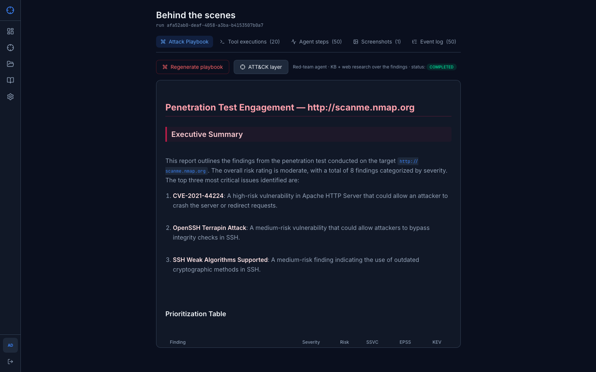

<p align="center">
  
</p>

<p align="center">
  <a href="#quick-start">Quick Start</a> &bull;
  <a href="#ui-overview">UI overview</a> &bull;
  <a href="#architecture">Architecture</a> &bull;
  <a href="#agent-pipeline">Agents</a> &bull;
  <a href="#tools">Tools</a> &bull;
  <a href="#llm-providers">LLM Providers</a> &bull;
  <a href="#contributing">Contributing</a> &bull;
  <a href="#license">License</a>
</p>

<p align="center">
  
  
  
  
  
  
  
  
</p>

---

## What is RedWeaver?

RedWeaver is an autonomous vulnerability assessment platform that combines LLM reasoning with real security tools. You describe a target, and a team of AI agents collaboratively performs reconnaissance, crawling, fuzzing, vulnerability scanning, exploit analysis, and report generation — all streamed to your browser in real time over WebSocket.

It runs on **Django (DRF + Channels)** with **PostgreSQL as the single system of record**: every run, finding, agent transition, tool execution (including **raw tool output**), reasoning step, and screenshot is persisted and replayable — debuggable through Django Admin and a dedicated "behind the scenes" UI. The knowledge base is a **pgvector RAG** in Postgres.

**Scope hunts with MITRE ATT&CK.** Before a run you can pick ATT&CK techniques (in a built-in picker or by pasting an [ATT&CK Navigator](https://mitre-attack.github.io/attack-navigator/) layer); the crew is then scoped to the agents behind those tactics and a focus directive is injected into every task. The agents consult a **practitioner-grade knowledge base** (75 files across 14 domains — recon → web → AD → cloud → C2, each with detection & mitigation), and any run's coverage exports back to a one-click **Open in ATT&CK Navigator** layer.

**Zero tool installation.** Everything runs inside Docker. You only need an LLM API key.

---

## UI overview

The web UI is a React app (Vite) served behind nginx in Docker. After login you get:

| Area | What you use it for |
|------|---------------------|
| **Dashboard** | Hunt stats, severity breakdown, latest findings at a glance |
| **Hunt** | Chat-driven hunts with live agent stream (WebSocket), in-thread pentest report, and agent flow panel |
| **Findings** | Sortable vulnerability list with severity badges, CVE references, and evidence |
| **Behind the scenes** | Per-run debug view — live topology, agent timeline, tool executions with **raw output**, screenshots, and the full event log; plus a one-click **OffSec playbook** (per-finding attack steps with commands + MITRE ATT&CK, grounded in the pgvector KB) |
| **Sessions & Targets** | Workspace-scoped projects, session management, target tracking, and **Plan with ATT&CK** — scope a hunt to chosen MITRE ATT&CK techniques |
| **Knowledge Base** | Searchable practitioner methodology library (pgvector RAG) — 14 domains (recon → web → AD → cloud → C2) with commands, payloads, and detection/mitigation |
| **Settings** | Multi-provider LLM configuration (OpenAI, Anthropic, Google, Ollama, Meta) |

### Screenshots

PNG captures live under `docs/screenshots/`. When updating them, use masked or empty API-key fields and non-sensitive targets only — never commit real keys or private hostnames in images.

<p align="center">
  <br/>
  <sub>Dashboard — hunt stats, severity breakdown, and latest findings</sub>
</p>
<p align="center">
  <br/>
  <sub>Hunt — pentest report, agent flow panel, and chat interface</sub>
</p>
<p align="center">
  <br/>
  <sub>Findings — vulnerability list sorted by severity with CVE details</sub>
</p>
<p align="center">
  <br/>
  <sub>Sessions & Targets — workspaces and project management</sub>
</p>
<p align="center">
  <br/>
  <sub>Settings — multi-provider LLM configuration</sub>
</p>
<p align="center">
  <br/>
  <sub>Behind the scenes — per-run debug: tool executions with raw output, agent steps, screenshots, event log, and the OffSec playbook</sub>
</p>

---

## Quick Start

```bash
# 1. Clone the repo
git clone https://github.com/TarzEH/RedWeaver.git
cd RedWeaver

# 2. Configure API keys
cp .env.example .env
# Edit .env — add at least one LLM key (OpenAI, Anthropic, or Google)

# 3. Build and run
docker compose up --build

# 4. Open the UI
open http://localhost:5173
```

The API is exposed at **http://localhost:8001** (host port mapped to the backend container). The UI talks to it through the frontend nginx proxy (`/api`). Type a target URL in the Hunt chat and the agents will start hunting.

### Demo login (first boot)

On a **fresh** Postgres volume, the one-shot `migrate` service seeds a demo admin so you can sign in immediately:

| Field | Value |
|-------|--------|
| Email | `admin@redweaver.local` |
| Password | `admin` |

**Change this password** (or register a new user and delete the demo account) before exposing the app beyond your machine. See [SECURITY.md](SECURITY.md).

> **Tip:** API keys can also be configured in the **Settings** page after launch — no `.env` edits required.

---

## Architecture

<p align="center">
  
</p>

### How It Works

1. **You describe a target** — "Scan example.com for vulnerabilities"
2. **CrewAI builds a crew** — target type (web vs host) and options pick which agents run; an optional **pre-hunt ATT&CK plan** narrows the crew to the agents behind the techniques you chose and injects a focus directive into each task; tasks chain with shared context
3. **Tasks run in order, with parallel batches where safe** — after **Recon** completes, **Fuzzer** and **Vuln Scanner** are scheduled as **asynchronous tasks** so CrewAI can run them **in parallel**, then **Crawler** and later steps run when their inputs are ready. Steps that need prior outputs (e.g. exploit analysis after all scans) still wait — correctness comes before wall-clock speed.
4. **Findings stream in real-time** — a WebSocket (Django Channels) pushes every tool call, thought, transition, and finding to the UI; all of it is persisted to Postgres and replayed on reconnect
5. **Report is generated** — the Report Writer produces a **structured Markdown** pentest report (headings, tables, lists, code blocks, callouts), grounded in hunt context and the pgvector knowledge base; the UI can render it in Standard or Enhanced styling. An optional **OffSec playbook** turns the findings into per-finding attack steps with commands and MITRE ATT&CK techniques.

### Why the graph looks “parallel”

The **workflow graph** is a **dependency diagram**: arrows show which agents consume outputs from others (e.g. many edges from Recon). It is **not** a Gantt chart. Branches do not mean “everything runs at the same time” — they mean “these steps all use data from Recon.” Actual execution follows the crew’s task list, with **parallelism only where tools are independent** and CrewAI’s async batching allows it.

---

## Agent Pipeline

The **workflow graph** may show an **Orchestrator** node for visualization only. Which agents run depends on target type (web vs host/network) and options (e.g. SSH post-exploit).

| Phase | Agent | What It Does |
|:-----:|-------|-------------|
| 1 | **Recon** | Subdomain enumeration, port scanning, tech fingerprinting |
| 2a / 2b | **Fuzzer** · **Vuln Scanner** | Run **in parallel** after recon (async batch): fuzzing + nuclei/nikto |
| 3 | **Crawler** | Endpoint discovery, JS analysis, form extraction (web targets; waits for fuzzer when present) |
| 4 | **Web Search** | OSINT — CVE lookup, exploit databases, public disclosures |
| 5 | **Exploit Analyst** | Attack chain correlation, risk assessment |
| 6 | **Report Writer** | Structured **Markdown** report (methodology, findings, remediation) |
| 7 | **Privesc / Tunnel / Post-exploit** | Optional when SSH targets are configured |

Phases are **logical**; the exact task order is defined in code (`CrewFactory`) and may differ slightly by target (e.g. no crawler on non-web targets).

Every scan agent can call **`knowledge_search`** to ground its methodology in the pgvector KB, and when a **pre-hunt ATT&CK plan** is supplied the agent set is scoped to the selected tactics (`select_agent_names(attack_techniques=…)`).

### Pre-hunt ATT&CK planning

From **Sessions & Targets**, click **Plan with ATT&CK** to pick techniques (curated picker grouped by tactic, or paste an [ATT&CK Navigator](https://mitre-attack.github.io/attack-navigator/) layer JSON). A live preview (`POST /api/attack/plan`) shows the derived target type, tactics, and **which agents will run**, plus a one-click **Open plan in Navigator**. After a run, the report's *Framework Coverage* card exports the observed techniques as a Navigator layer too (`GET /api/runs/<id>/attack-navigator`). A Celery-beat **watchdog** (`reap_stuck_runs`) fails any run orphaned past its timeout, so the dashboard never shows a hung "running" scan.

---

## Tools

All tools run as CLI binaries inside the Docker container — no external accounts or paid APIs needed.

| Tool | Category | Purpose |
|------|----------|---------|
| [nmap](https://nmap.org/) | Recon | Port scanning — deep default scan (`-sV -sC`, top-1000 ports) with service/version + default-script parsing |
| [subfinder](https://github.com/projectdiscovery/subfinder) | Recon | Subdomain enumeration |
| [httpx](https://github.com/projectdiscovery/httpx) | Recon | HTTP probing, tech detection |
| [whatweb](https://github.com/urbanadventurer/WhatWeb) | Recon | Web technology fingerprinting |
| [theHarvester](https://github.com/laramies/theHarvester) | OSINT | Email, subdomain, IP harvesting |
| [nuclei](https://github.com/projectdiscovery/nuclei) | Scanning | Template-based vulnerability scanning |
| [nikto](https://github.com/sullo/nikto) | Scanning | Web server misconfiguration scanner |
| [ffuf](https://github.com/ffuf/ffuf) | Fuzzing | Web fuzzer for directories and parameters (file-extension + recursive discovery) |
| [gobuster](https://github.com/OJ/gobuster) | Fuzzing | Directory/DNS brute-forcing |
| [katana](https://github.com/projectdiscovery/katana) | Crawling | Web crawler for endpoint discovery |

---

## LLM Providers

RedWeaver supports multiple LLM providers. Configure via `.env` or the **Settings** UI at runtime.

| Provider | Models | Key Variable |
|----------|--------|-------------|
| **OpenAI** | GPT-4 family, GPT-4o, GPT-4o-mini (see Settings) | `OPENAI_API_KEY` |
| **Anthropic** | Claude Opus / Sonnet / Haiku (see Settings) | `ANTHROPIC_API_KEY` |
| **Google** | Gemini (see Settings) | `GOOGLE_API_KEY` |
| **Ollama** | Llama, Mistral, Qwen, etc. (local) | `OLLAMA_BASE_URL` |

> At least one provider key is required. The cheapest models (GPT-4o-mini, Haiku, Gemini Flash) work well for most targets.

---

## Environment Variables

| Variable | Required | Description |
|----------|:--------:|-------------|
| `OPENAI_API_KEY` | * | OpenAI API key |
| `ANTHROPIC_API_KEY` | * | Anthropic API key |
| `GOOGLE_API_KEY` | * | Google Gemini API key |
| `POSTGRES_DB` / `POSTGRES_USER` / `POSTGRES_PASSWORD` | Yes | Postgres credentials; Compose composes `DATABASE_URL` from them |
| `DJANGO_SECRET_KEY` | **Yes for production** | Django secret key |
| `JWT_SECRET` | No | Secret for signing auth tokens (falls back to `DJANGO_SECRET_KEY` if unset) |
| `OLLAMA_BASE_URL` | No | Ollama server URL (default: `http://host.docker.internal:11434`) |
| `REDIS_URL` / `CHANNEL_LAYERS_URL` / `CELERY_BROKER_URL` | No | Redis roles split by DB — `/0` pub/sub, `/1` Channels, `/2` Celery (composed by Compose) |
| `CSRF_TRUSTED_ORIGINS` / `ALLOWED_HOSTS` | No | Django host/CSRF allow-lists (defaults cover localhost) |
| `SCREENSHOTS_DIR` | No | Playwright screenshot path under the shared media volume |

> \* At least one LLM provider key is required. Keys can also be set in the Settings UI.

---

## Project Structure

```
RedWeaver/
├── backend/
│   ├── manage.py
│   ├── entrypoint.sh            # Role dispatch: migrate | web | worker
│   ├── redweaver/               # Django project: settings/, asgi.py, wsgi.py, celery.py, urls.py
│   ├── redweaver_engine/        # Framework-agnostic engine (no Django imports)
│   │   ├── crews/               # CrewAI crews (bug_hunt + offsec)
│   │   ├── tools/               # CrewAI tools, cli/ wrappers, instrumentation seam
│   │   ├── reports/             # Report generation and templates
│   │   ├── clients/             # Outbound HTTP clients
│   │   └── llm_factory.py       # Multi-provider LLM factory
│   └── apps/
│       ├── common/              # TimeStampedUUIDModel, pagination, encrypted field
│       ├── accounts/            # User (AUTH_USER_MODEL), ApiKeyVault, JWT auth, settings/keys
│       ├── workspaces/          # Workspace
│       ├── hunts/               # Session, Target, Run + tasks.py (Celery), offsec_tasks.py, consumers.py
│       ├── findings/            # Finding (+ confidence/exploitability/CVE)
│       ├── observability/       # ToolExecution, AgentStep, AgentTransition, EventLog, GraphSnapshot, Screenshot
│       ├── knowledge/           # pgvector RAG: KbChunk, embeddings, search, ingest_kb
│       ├── reports/             # Persisted Report
│       └── agents/              # Thin endpoints over redweaver_engine (tools, topology)
├── docs/
│   ├── ARCHITECTURE.md          # Docker images vs package layers
│   └── screenshots/             # UI PNGs embedded above under “UI overview”
├── frontend/
│   └── src/
│       ├── app/                 # Router, shell
│       ├── components/          # layout, ui, domain
│       ├── config/              # Provider/model definitions
│       ├── contexts/            # Auth, Hunt
│       ├── features/            # Route-level pages (incl. debug/)
│       ├── hooks/               # useSSE (→ WebSocket), useRunStream
│       ├── services/            # api.ts, http.ts (JWT client)
│       └── types/               # TypeScript interfaces (API, events)
├── knowledge-base/              # Markdown methodology library (ingested into pgvector)
├── knowledge-service/           # Legacy Chroma RAG microservice (HTTP fallback only)
├── docker-compose.yml           # postgres (pgvector), redis, migrate, web, worker, frontend, redis-insight
├── backend/Dockerfile           # Backend with security tools + Playwright Chromium
└── .env.example                 # Environment configuration template
```

---

## Key Design Decisions

- **Django + Postgres system of record** — Django (DRF + Channels) serves the API and WebSocket; **PostgreSQL holds all state** (runs, findings, observability, KB vectors). Redis is transport only (Channels layer + Celery broker + pub/sub).
- **Framework-agnostic engine** — the CrewAI crews, tools, reports, and LLM factory live in `redweaver_engine/` with zero Django imports, wired to persistence through a pluggable instrumentation seam so the engine stays importable and testable on its own.
- **Out-of-process execution** — `crew.kickoff()` runs in a **Celery worker**, not the ASGI loop, so long hunts and synchronous ORM writes never block the web server.
- **CrewAI** — hunts are built from YAML agent/task definitions (`redweaver_engine/crews/bug_hunt/`) with a `CrewFactory` that wires tools, structured outputs, and `Process.sequential`. Consecutive `async_execution` tasks run in **parallel batches** (e.g. fuzzer + vuln scanner after recon). The workflow **graph** is dependency-oriented, not a timeline.
- **End-to-end observability** — every tool execution (with **raw stdout/stderr**), agent step, transition, screenshot, and event is persisted and replayable via Django Admin and the `/debug/<run_id>` UI.
- **pgvector RAG** — the knowledge base is embedded into Postgres (`text-embedding-3-small`, 1536-dim) and queried with cosine distance; the legacy Chroma microservice remains only as a fallback.
- **OffSec playbook** — an offensive-security agent turns findings into per-finding attack steps (commands + MITRE ATT&CK), grounded in the pgvector KB.
- **Multi-provider LLM factory** — auto-detects available keys (OpenAI, Anthropic, Google Gemini, Ollama) with runtime model selection (Settings UI or env).
- **Markdown-first report** — the Report Writer outputs structured Markdown; the React report view renders it with typography and callouts, plus an optional **Enhanced** reading mode.

---

## Development

```bash
# Backend (requires Python 3.11+, a running Postgres + Redis)
cd backend
pip install -r requirements.txt
python manage.py migrate
python manage.py ingest_kb                 # embed the knowledge base into pgvector
daphne redweaver.asgi:application          # ASGI: DRF + Channels
celery -A redweaver worker                 # in a second shell — runs the hunts

# Frontend (requires Node 20+)
cd frontend
npm install
npm run dev
```

Or use Docker for everything (recommended — brings up Postgres, Redis, web, worker, and the frontend):

```bash
docker compose up --build
```

---

## Disclaimer

RedWeaver is a security research and educational tool. **Only use it against targets you own or have explicit permission to test.** Unauthorized vulnerability scanning is illegal in most jurisdictions. The authors are not responsible for any misuse.

---

## Contributing

See [CONTRIBUTING.md](CONTRIBUTING.md).

---

## License

[MIT](LICENSE) &copy; 2025-2026 Ori Ashkenazi
