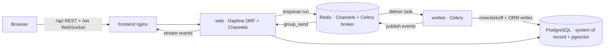

# RedWeaver architecture and Docker layout

This document maps **Docker images** (what gets copied and how processes start) to **Python/TS package layers** in the repo.

RedWeaver runs on **Django (DRF + Channels)** with **PostgreSQL as the single system of record** and **Redis** as a transport only (Channels layer + Celery broker + live pub/sub). The security/agent engine is kept framework-agnostic in `redweaver_engine/` so it can be imported and tested without Django.

## Compose services

| Service | Build context | Purpose |
|---------|---------------|---------|
| `postgres` | `pgvector/pgvector:pg16` | System of record — all runs, findings, observability, and the KB vector index (`vector` extension) |
| `redis` | `redis:7-alpine` | Transport only: Channels layer (`/1`), Celery broker (`/2`), live pub/sub (`/0`) |
| `migrate` | `./backend` | One-shot: `migrate` + `collectstatic` + seed admin + `ingest_kb` (embeds the knowledge base into pgvector), then exits |
| `web` | `./backend` | Daphne ASGI — DRF REST API + Channels WebSocket (`/ws/`) + Django Admin |
| `worker` | `./backend` | Celery worker — runs `crew.kickoff()`, Playwright screenshots, and all ORM writes out-of-process |
| `frontend` | `./frontend` | Vite build served by nginx; proxies `/api`, `/ws`, `/admin`, `/static`, `/media` to `web` |
| `knowledge` | `./knowledge-service` | **Legacy** standalone Chroma RAG — kept only as an HTTP fallback; pgvector is the primary KB |
| `redis-insight` | Image only | Optional Redis browser (dev) |

Host ports: web **8001→8000**, frontend **5173→80**, postgres **5433→5432**, redis **6380→6379**, redis-insight **5541→5540**.

Volumes: `pg_data`, `redis_data`, `static_data`, `screenshots_data` (shared by `web`+`worker`), `knowledge_model_cache`. The `./knowledge-base` directory is mounted read-only into `migrate`/`web`/`worker` for `ingest_kb`.

`web`, `worker`, and `migrate` all build from the **same** `./backend` image and differ only by `command` — the worker needs the full toolchain (nmap/nuclei/ffuf + Chromium for Playwright).

---

## Backend image (`backend/Dockerfile`)

Multi-stage build for layer caching:

1. **`tools`**: Python slim + OS packages + nikto/whatweb + Go + scanner CLIs + wordlists + Playwright Chromium (`--with-deps`).
2. **`deps`**: `WORKDIR /app`, `COPY requirements.txt`, `pip install -r requirements.txt`.
3. **`runtime`** (final): `COPY redweaver/ redweaver_engine/ apps/ manage.py entrypoint.sh`, `ENTRYPOINT entrypoint.sh`.

`entrypoint.sh` waits for Postgres, then dispatches by role:

| Role | Command |
|------|---------|
| `migrate` | `migrate` → `collectstatic` → `seed_admin` → `ingest_kb` (one-shot) |
| `web` | `daphne redweaver.asgi:application` (ASGI: DRF + Channels) |
| `worker` | `celery -A redweaver worker` |

Backend Python layout:

| Package | Role |
|---------|------|
| `redweaver/` | Django project: `settings/{base,dev,prod,test}`, `asgi.py` (ProtocolTypeRouter: HTTP + WebSocket), `wsgi.py`, `celery.py`, `urls.py` |
| `redweaver_engine/` | **Framework-agnostic** engine (zero `from app.*`/`from apps.*` imports): `crews/` (CrewAI bug-hunt + offsec), `tools/` (CLI wrappers + crewai adapter + instrumentation seam), `reports/`, `clients/`, `llm_factory.py` |
| `apps/common/` | `TimeStampedUUIDModel` (UUID PK + created/updated), pagination, permissions, encrypted field |
| `apps/accounts/` | Custom `User` (`AUTH_USER_MODEL`) + encrypted `ApiKeyVault` + JWT auth + settings/keys |
| `apps/workspaces/` | `Workspace` |
| `apps/hunts/` | `Session`, `Target`, `Run` + `tasks.py` (Celery `execute_run`) + `offsec_tasks.py` + `crew_factory.py` + `consumers.py` (Channels) |
| `apps/findings/` | `Finding` (+ confidence / exploitability / CVE / evidence) |
| `apps/observability/` | The debug core — see below |
| `apps/knowledge/` | **Postgres pgvector RAG**: `KbChunk` (1536-dim `VectorField`), `embeddings.py`, `search.py`, `ingest_kb` command |
| `apps/reports/` | Persisted `Report` |
| `apps/agents/` | Thin endpoints over `redweaver_engine` (tools list, graph topology) |

---

## Observability — the "behind the scenes" core

Everything an agent does is persisted in Postgres (FK to `Run`, ordered by `sequence`) and replayable. Surfaced via **Django Admin** (`RunAdmin` with inlines) and the frontend **debug UI** (`/debug/<run_id>`).

| Model | Captures |
|-------|----------|
| `ToolExecution` | `argv`, command string, **raw stdout/stderr**, exit code, parsed result, timings, status |
| `AgentStep` | reasoning text, step type, from/to agent, structured output, confidence |
| `AgentTransition` | edge list (from → to) for the live topology graph |
| `EventLog` | verbatim event stream — the source of truth for full replay |
| `GraphSnapshot` | topology evolution (active/completed nodes, plan, nodes/edges) |
| `HuntflowNode` | the reasoning tree (self-FK parent) |
| `Screenshot` | Playwright capture path + metadata, linked to the triggering tool execution |

The instrumentation seam lives in `redweaver_engine/tools/instrumentation.py` (contextvars + pluggable no-op sinks). Django registers the real sinks at startup in `apps/observability/apps.py::ready()` — `tool_recorder` (writes `ToolExecution`), `event_publisher` (writes `EventLog` + pushes to Channels), and `kb_searcher` (pgvector). This keeps `redweaver_engine` importable without Django while wiring full persistence under it.

---

## Frontend image (`frontend/Dockerfile`)

- **Stage `build`**: `WORKDIR /app`, `npm install`, `COPY . .`, `npm run build` → `dist/`
- **Stage (nginx)**: `COPY dist` → `/usr/share/nginx/html`, `nginx.conf` for SPA routing + proxy blocks (`/api/`, `/ws/`, `/admin/`, `/static/`, `/media/`) and `map $connection_upgrade` for WebSocket upgrades
- **Source layout**: `src/` with `app/`, `features/` (incl. `debug/`), `components/`, `services/`, `hooks/`, `config/`, `contexts/`, `types/`

`VITE_BACKEND_URL` is baked at build time (see Dockerfile `ARG`).

---

## Knowledge base — Postgres pgvector RAG

The KB is ingested into Postgres as embeddings, not served from a separate microservice:

- `manage.py ingest_kb` reads `knowledge-base/**/*.md`, chunks it, embeds each chunk with OpenAI `text-embedding-3-small` (1536-dim), and bulk-inserts `KbChunk` rows.
- `apps/knowledge/search.py::kb_search()` ranks by `CosineDistance` and returns the top matches (~250 ms).
- Agents (and the OffSec playbook) query the KB through `instrumentation.kb_search`; the standalone `knowledge` (Chroma) service remains only as an HTTP fallback.

---

## Data flow (high level)

A run is enqueued by the REST API, executed in the Celery `worker` (out of the ASGI event loop), which writes all state to Postgres and publishes events through Redis; `web` relays them to the browser over the WebSocket and rehydrates on reconnect by replaying `EventLog`.

---

## Related files

- Root: [docker-compose.yml](../docker-compose.yml)
- Backend: [backend/Dockerfile](../backend/Dockerfile), [backend/entrypoint.sh](../backend/entrypoint.sh)
- Frontend: [frontend/Dockerfile](../frontend/Dockerfile), [frontend/nginx.conf](../frontend/nginx.conf)
- Knowledge (legacy fallback): [knowledge-service/Dockerfile](../knowledge-service/Dockerfile)
