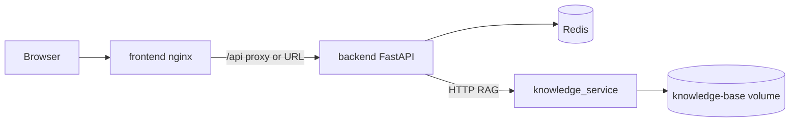

# RedWeaver architecture and Docker layout

This document maps **Docker images** (what gets copied and how processes start) to **Python/TS package layers** in the repo.

## Compose services

| Service | Build context | Purpose |
|---------|---------------|---------|
| `backend` | `./backend` | FastAPI API, CrewAI hunts, Redis persistence |
| `frontend` | `./frontend` | Vite build served by nginx |
| `knowledge` | `./knowledge-service` | Chroma RAG over `knowledge-base/` volume |
| `redis` | Image only | Data store |

Volumes: `./data` (backend), `./knowledge-base` (knowledge service, read-only).

---

## Backend image (`backend/Dockerfile`)

Multi-stage build for layer caching:

1. **`tools`**: Python slim + OS packages + nikto/whatweb + Go + scanner CLIs + wordlists.
2. **`deps`**: `WORKDIR /app`, `COPY requirements.txt`, `pip install -r requirements.txt`.
3. **`runtime`** (final): `COPY app/ ./app/`, `uvicorn app.main:app`.

Changing only Python under `app/` invalidates only the last stage; dependency installs stay cached when `requirements.txt` is unchanged.

- **WORKDIR**: `/app` (from `deps` onward)
- **Command**: `uvicorn app.main:app --host 0.0.0.0 --port 8000`

Logical layers under `app/` (single Python package; imports stay `from app.*`):

| Folder | Role |
|--------|------|
| `api/` | HTTP routers and middleware |
| `core/` | Config, DI (`deps`), security, logging, LLM factory, event bus, errors |
| `domain/` | Domain entities |
| `dto/` | Request/response shapes for APIs |
| `models/` | API/persistence DTOs shared by routers and Redis (`run`, `chat`, `keys`, `huntflow`) |
| `services/` | Application / use-case services |
| `repositories/` | Redis (and protocol) persistence |
| `clients/` | Outbound HTTP clients to external APIs |
| `crews/` | CrewAI crews (e.g. `bug_hunt/` with YAML config + builder) |
| `tools/` | CrewAI tools and CLI wrappers |
| `reports/` | Report generation and templates |
| `graph/` | Re-exports hunt graph topology (`get_graph_topology`) from `crews.bug_hunt.graph` |

---

## Frontend image (`frontend/Dockerfile`)

- **Stage `build`**: `WORKDIR /app`, `npm install`, `COPY . .`, `npm run build` → `dist/`
- **Stage (nginx)**: `COPY dist` → `/usr/share/nginx/html`, `nginx.conf` for SPA routing
- **Source layout**: `src/` with `app/`, `features/`, `components/`, `services/`, `hooks/`, `config/`, `contexts/`, `types/`

`VITE_BACKEND_URL` is baked at build time (see Dockerfile `ARG`).

---

## Knowledge service (`knowledge-service/Dockerfile`)

- **WORKDIR**: `/app`
- **Copy**: `requirements.txt`, `src/knowledge_service/`
- **ENV**: `PYTHONPATH=/app/src`
- **Command**: `uvicorn knowledge_service.main:app --port 8100`

Markdown content is **not** in the image; `docker-compose` mounts `./knowledge-base` at `/data/knowledge` (see service env in `main.py`).

---

## Data flow (high level)

---

## Related files

- Root: [docker-compose.yml](../docker-compose.yml)
- Backend: [backend/Dockerfile](../backend/Dockerfile)
- Frontend: [frontend/Dockerfile](../frontend/Dockerfile)
- Knowledge: [knowledge-service/Dockerfile](../knowledge-service/Dockerfile)
