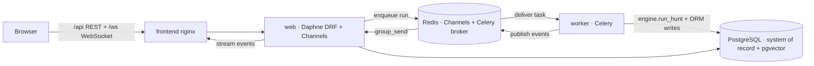

# RedWeaver architecture and Docker layout

This document maps **Docker images** (what gets copied and how processes start) to **Python/TS package layers** in the repo.

RedWeaver runs on **Django (DRF + Channels)** with **PostgreSQL as the single system of record** and **Redis** as a transport only (Channels layer + Celery broker + live pub/sub). The security/agent engine is kept framework-agnostic in `redweaver_engine/` so it can be imported and tested without Django.

## Compose services

| Service | Build context | Purpose |
|---------|---------------|---------|
| `postgres` | `pgvector/pgvector:pg16` | System of record — all runs, findings, observability, and the KB vector index (`vector` extension) |
| `redis` | `redis:7-alpine` | Transport only: Channels layer (`/1`), Celery broker (`/2`), live pub/sub (`/0`) |
| `migrate` | `./backend` | One-shot: `migrate` + `collectstatic` + seed admin + `ingest_kb` (embeds the knowledge base into pgvector), then exits |
| `web` | `./backend` | Daphne ASGI — DRF REST API + Channels WebSocket (`/ws/`) + Django Admin |
| `worker` | `./backend` | Celery worker — runs the hunt engine (`HuntEngine.run_hunt`), Playwright screenshots, and all ORM writes out-of-process |
| `frontend` | `./frontend` | Vite build served by nginx; proxies `/api`, `/ws`, `/admin`, `/static`, `/media` to `web` |
| `knowledge` | `./knowledge-service` | **Legacy** standalone Chroma RAG — kept only as an HTTP fallback; pgvector is the primary KB |
| `redis-insight` | Image only | Optional Redis browser (dev) |

Host ports: web **8001→8000**, frontend **5173→80**, postgres **5433→5432**, redis **6380→6379**, redis-insight **5541→5540**.

Volumes: `pg_data`, `redis_data`, `static_data`, `screenshots_data` (shared by `web`+`worker`), `knowledge_model_cache`. The `./knowledge-base` directory is mounted read-only into `migrate`/`web`/`worker` for `ingest_kb`.

`web`, `worker`, and `migrate` all build from the **same** `./backend` image and differ only by `command` — the worker needs the full toolchain (nmap/nuclei/ffuf + Chromium for Playwright).

---

## Backend image (`backend/Dockerfile`)

Multi-stage build for layer caching:

1. **`tools`**: Python slim + OS packages + nikto/whatweb + Go + scanner CLIs + wordlists + Playwright Chromium (`--with-deps`).
2. **`deps`**: `WORKDIR /app`, `COPY requirements.txt`, `pip install -r requirements.txt`.
3. **`runtime`** (final): `COPY redweaver/ redweaver_engine/ apps/ manage.py entrypoint.sh`, `ENTRYPOINT entrypoint.sh`.

`entrypoint.sh` waits for Postgres, then dispatches by role:

| Role | Command |
|------|---------|
| `migrate` | `migrate` → `collectstatic` → `seed_admin` → `ingest_kb` (one-shot) |
| `web` | `daphne redweaver.asgi:application` (ASGI: DRF + Channels) |
| `worker` | `celery -A redweaver worker` |

Backend Python layout:

| Package | Role |
|---------|------|
| `redweaver/` | Django project: `settings/{base,dev,prod,test}`, `asgi.py` (ProtocolTypeRouter: HTTP + WebSocket), `wsgi.py`, `celery.py`, `urls.py` |
| `redweaver_engine/` | **Framework-agnostic** engine (zero `from app.*`/`from apps.*` imports): `crews/` (CrewAI bug-hunt + offsec **and** the deepagents/LangGraph DAG engine in `crews/bug_hunt/graph_engine.py`), `tools/` (CLI wrappers + `crewai_adapter` + `langchain_adapter` + instrumentation seam), `reports/`, `clients/`, `llm_factory.py` |
| `apps/common/` | `TimeStampedUUIDModel` (UUID PK + created/updated), pagination, permissions, encrypted field |
| `apps/accounts/` | Custom `User` (`AUTH_USER_MODEL`) + encrypted `ApiKeyVault` + JWT auth + settings/keys |
| `apps/workspaces/` | `Workspace` |
| `apps/hunts/` | `Session`, `Target`, `Run` + `tasks.py` (Celery `execute_run`) + `offsec_tasks.py` + `crew_factory.py` + `engines/` (pluggable `HuntEngine`: CrewAI / deepagents) + `consumers.py` (Channels) |
| `apps/findings/` | `Finding` (+ confidence / exploitability / CVE / evidence) |
| `apps/observability/` | The debug core — see below |
| `apps/knowledge/` | **Postgres pgvector RAG**: `KbChunk` (configurable-dim `VectorField`) + `KbEmbeddingConfig` (UI-editable provider/model), `embeddings.py` (OpenAI **or** offline HuggingFace), `chunking.py`, `ingest.py`, `search.py`, `tasks.py` (re-index), `ingest_kb`/`eval_kb`/`eval_kb_ragas` commands, `eval/` (Ragas harness) |
| `apps/reports/` | Persisted `Report` |
| `apps/agents/` | Thin endpoints over `redweaver_engine` (tools list, graph topology) |

---

## Orchestration engine — pluggable (`HUNT_ENGINE`)

The multi-agent orchestrator is selectable behind a flag so it can be migrated
incrementally. `apps/hunts/engines/` defines a `HuntEngine` protocol
(`run_hunt` / `run_offsec` → a normalized `HuntResult`); `execute_run` and
`generate_offsec_playbook` call it instead of an orchestrator directly.

| `HUNT_ENGINE` | Engine | How it works |
|---------------|--------|--------------|
| `crewai` (default) | `CrewAIEngine` | The mature path: `CrewFactory` builds a CrewAI crew (YAML agents/tasks, `Process.sequential` + async batching), `crew.kickoff()`. |
| `deepagents` | `DeepAgentsEngine` | `crews/bug_hunt/graph_engine.py` builds an explicit **LangGraph `StateGraph`** of `deepagents` sub-agents — each agent a node (YAML prompt, registry tools via `langchain_adapter`, Pydantic schema as `response_format`), edges encoding the deterministic DAG: recon → {fuzzer ∥ vuln_scanner ∥ crawler ∥ web_search} → exploit_analyst → [privesc → tunnel_pivot → post_exploit] → report_writer. |

Both engines feed the **same** observability sinks: tool calls go through an
adapter (`crewai_adapter` / `langchain_adapter`) that emits identical
`tool_call`/`tool_result` events + `ToolExecution` rows, and an event bridge
(`callbacks.CrewAIEventBridge` / `graph_bridge.LangGraphHuntBridge`) maps
agent lifecycle + structured output to the same findings/events. The deepagents
migration is tracked in [refactor-deepagents-ragas.md](refactor-deepagents-ragas.md);
CrewAI remains the default until parity is proven.

---

## Observability — the "behind the scenes" core

Everything an agent does is persisted in Postgres (FK to `Run`, ordered by `sequence`) and replayable. Surfaced via **Django Admin** (`RunAdmin` with inlines) and the frontend **debug UI** (`/debug/<run_id>`).

| Model | Captures |
|-------|----------|
| `ToolExecution` | `argv`, command string, **raw stdout/stderr**, exit code, parsed result, timings, status |
| `AgentStep` | reasoning text, step type, from/to agent, structured output, confidence |
| `AgentTransition` | edge list (from → to) for the live topology graph |
| `EventLog` | verbatim event stream — the source of truth for full replay |
| `GraphSnapshot` | topology evolution (active/completed nodes, plan, nodes/edges) |
| `HuntflowNode` | the reasoning tree (self-FK parent) |
| `Screenshot` | Playwright capture path + metadata, linked to the triggering tool execution |

The instrumentation seam lives in `redweaver_engine/tools/instrumentation.py` (contextvars + pluggable no-op sinks). Django registers the real sinks at startup in `apps/observability/apps.py::ready()` — `tool_recorder` (writes `ToolExecution`), `event_publisher` (writes `EventLog` + pushes to Channels), and `kb_searcher` (pgvector). This keeps `redweaver_engine` importable without Django while wiring full persistence under it.

---

## Frontend image (`frontend/Dockerfile`)

- **Stage `build`**: `WORKDIR /app`, `npm install`, `COPY . .`, `npm run build` → `dist/`
- **Stage (nginx)**: `COPY dist` → `/usr/share/nginx/html`, `nginx.conf` for SPA routing + proxy blocks (`/api/`, `/ws/`, `/admin/`, `/static/`, `/media/`) and `map $connection_upgrade` for WebSocket upgrades
- **Source layout**: `src/` with `app/`, `features/` (incl. `debug/`), `components/`, `services/`, `hooks/`, `config/`, `contexts/`, `types/`

`VITE_BACKEND_URL` is baked at build time (see Dockerfile `ARG`).

---

## Knowledge base — practitioner library, dual-store RAG

The `knowledge-base/` is a practitioner-grade library: **75 markdown files across 14 numbered domains** (`01-reconnaissance` … `14-tools-reference`), each with detection-driven methodology, real commands/payloads, and a **Detection & Mitigation** section for the offensive-heavy domains (C2, evasion, AD). It is indexed into **two stores from the same files**, categorized by the top-level numbered directory:

- **Postgres pgvector** (system of record for the UI): `manage.py ingest_kb` chunks the markdown (markdown-aware, fence-safe LangChain splitter in `chunking.py`) and embeds each chunk. The **embedding provider is configurable** via `KbEmbeddingConfig` (a global singleton, editable from the **Settings** UI) — OpenAI (`text-embedding-3-small`, 1536-dim) **or** a fully-offline local HuggingFace model (e.g. `all-MiniLM-L6-v2`, 384-dim) through the LangChain SDK; the pgvector column dimension is auto-detected and re-typed on re-index (`tasks.reindex_kb_task`). `search.py::kb_search()` ranks by `CosineDistance` + a keyword re-rank. Powers the **Knowledge Base viewer**, `/api/knowledge/*`, and the OffSec playbook (`instrumentation.kb_search`).
- **`knowledge` Chroma microservice** (`:8100`): **legacy HTTP fallback only** — builds an in-memory Chroma index from the mounted `knowledge-base/` on startup. The agents prefer pgvector and fall back to this service only if the in-process searcher is unavailable.

> After editing KB content, re-ingest pgvector via the **Settings → Knowledge Base Embeddings → Re-index** button, or `docker compose exec worker python manage.py ingest_kb`. Category vocabulary (`reconnaissance`, `web_attacks`, `vulnerability_scanning`, `privilege_escalation`, …) derives from the directory layout, so an agent's `category=` filter resolves consistently.

### Evaluation

Retrieval/answer quality is measured, not guessed: `manage.py eval_kb`
(hit@k + MRR over a labeled query set) and `manage.py eval_kb_ragas` — a **Ragas**
harness (`apps/knowledge/eval/`) scoring context recall/precision, faithfulness,
and answer relevancy over a golden Q/A set, using the same multi-provider LLM +
embeddings as judges (runs offline too). `--fail-under` makes it CI-gating.

---

## Data flow (high level)

A run is enqueued by the REST API, executed in the Celery `worker` (out of the ASGI event loop), which writes all state to Postgres and publishes events through Redis; `web` relays them to the browser over the WebSocket and rehydrates on reconnect by replaying `EventLog`.

---

## Related files

- Root: [docker-compose.yml](../docker-compose.yml)
- Backend: [backend/Dockerfile](../backend/Dockerfile), [backend/entrypoint.sh](../backend/entrypoint.sh)
- Frontend: [frontend/Dockerfile](../frontend/Dockerfile), [frontend/nginx.conf](../frontend/nginx.conf)
- Knowledge (Chroma service the agents query): [knowledge-service/Dockerfile](../knowledge-service/Dockerfile), [knowledge-service/src/knowledge_service/main.py](../knowledge-service/src/knowledge_service/main.py)
- ATT&CK pre-hunt planning: [backend/redweaver_engine/crews/bug_hunt/attack_planning.py](../backend/redweaver_engine/crews/bug_hunt/attack_planning.py) (technique→agent map, Navigator-layer parser, plan + layer builders) → `POST /api/attack/plan`, `GET /api/runs/<id>/attack-navigator`
- Engine abstraction + deepagents migration: [backend/apps/hunts/engines/](../backend/apps/hunts/engines/base.py), [backend/redweaver_engine/crews/bug_hunt/graph_engine.py](../backend/redweaver_engine/crews/bug_hunt/graph_engine.py), plan in [docs/refactor-deepagents-ragas.md](refactor-deepagents-ragas.md)
- RAG evaluation (Ragas): [backend/apps/knowledge/eval/ragas_eval.py](../backend/apps/knowledge/eval/ragas_eval.py) → `manage.py eval_kb_ragas`
- Reliability watchdog: `reap_stuck_runs` Celery-beat task in [backend/apps/hunts/tasks.py](../backend/apps/hunts/tasks.py) (scheduled in [backend/redweaver/celery.py](../backend/redweaver/celery.py))
